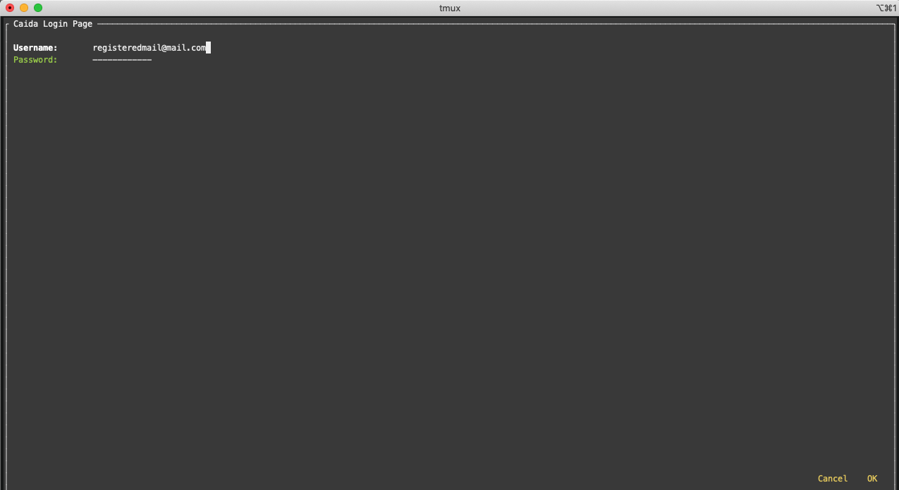
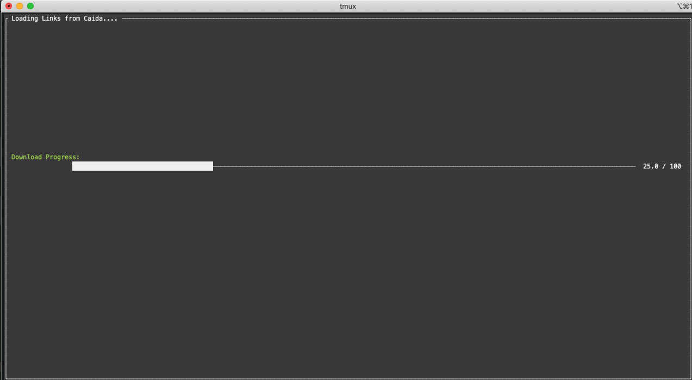
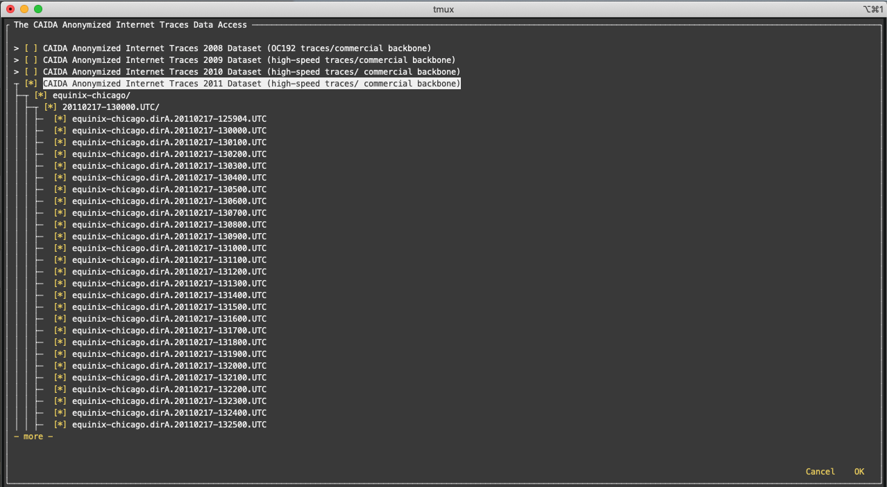
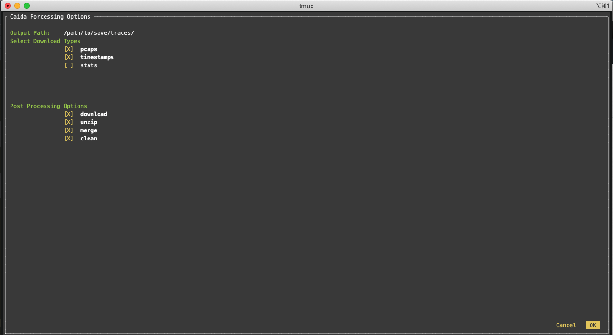
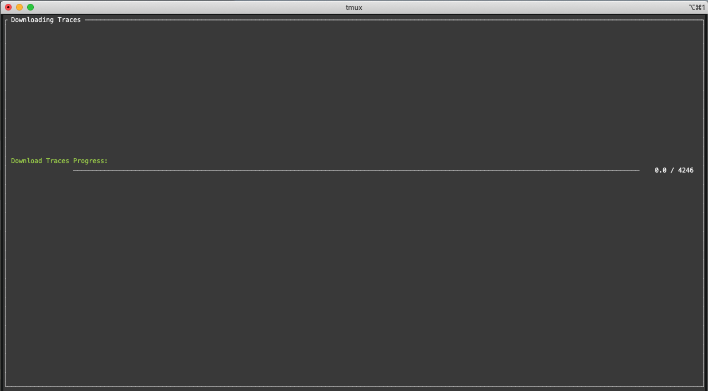

CAIDA TRACES DOWNLOADER
=======================

Tool to easily download, uncompress and merge caida pcap files, timestamps and statistics.

To install this tool just run the install script:

```
./install.sh
```

Once the tool is installed you can run it by typing `traceget` in your terminal.

```
traceget
```

First you will be promted with a `user` and `password` screen. Use your caida credentials to access your traces.


## Navigation

1. Use arrows and TAB to move around.
2. Use space to select or unselect boxes.
3. Use `>` to unfold menus and `<` to fold menus.

## Walkthrough

1. Login

<p align="center">

<p/>

<p align="center">

<p/>

<p align="center">

<p/>

<p align="center">

<p/>

<p align="center">

<p/>